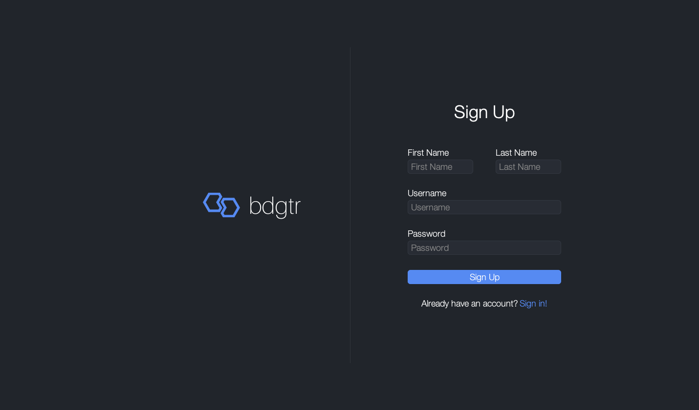
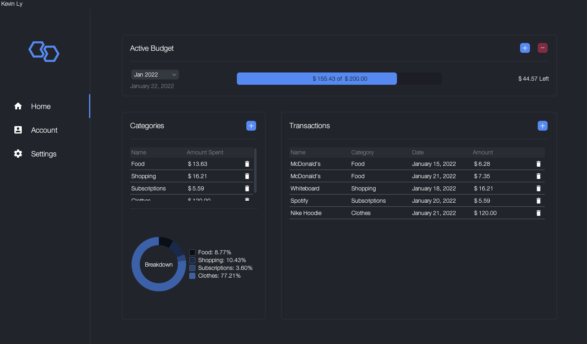
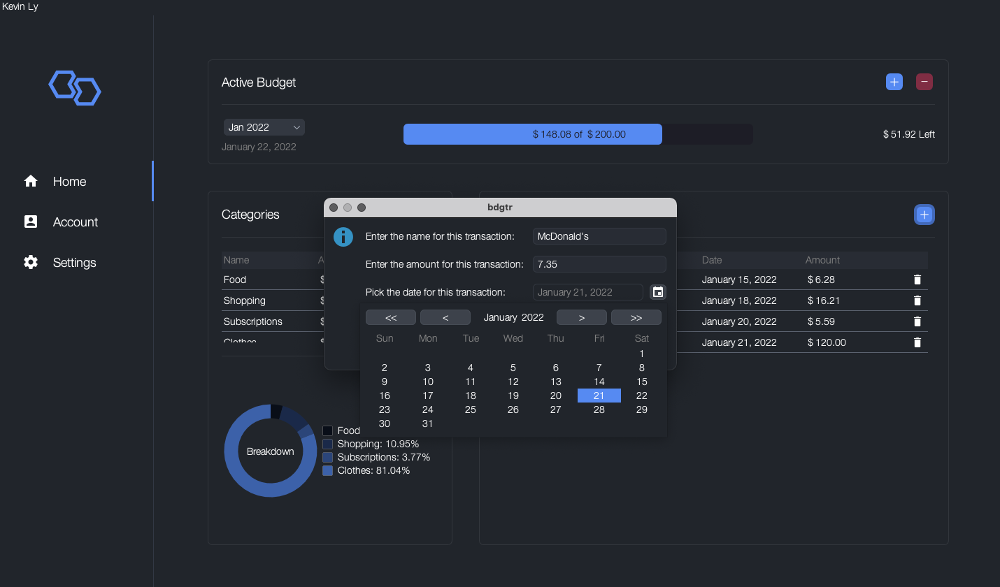
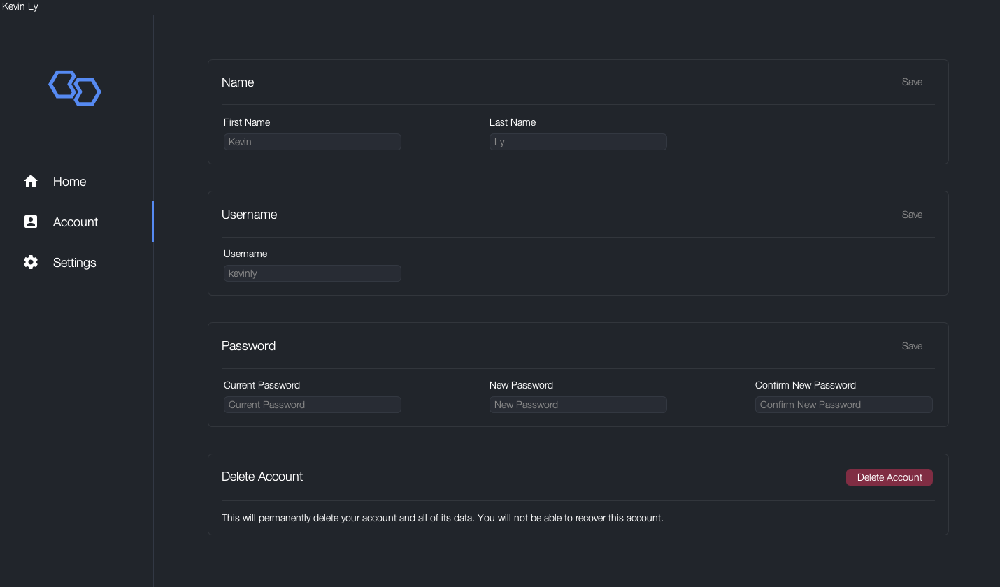
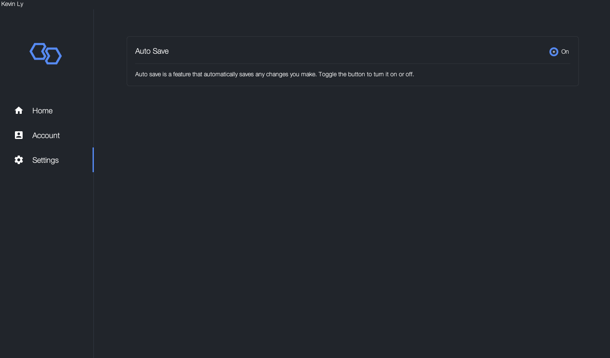

  

<h1 align="center">
  bdgtr
</h1>

  A personal finance application that helps you create budgets and track your spending.

## Features
- Sign up for **unlimited** accounts
- Create **unlimited** budgets
- Add up to 10 categories per budget
- Add **unlimited** transactions 
- View a doughnut chart that displays a breakdown of your budget by category
- View transaction history per budget
- Edit your account information
- Delete your account
- Auto Save

## Dependencies
- [FlatLaf - Flat Look and Feel](https://github.com/JFormDesigner/FlatLaf)
- [JFreeChart](https://github.com/jfree/jfreechart)
- [JSON in Java](https://github.com/stleary/JSON-java)
- [LGoodDatePicker](https://github.com/LGoodDatePicker/LGoodDatePicker)

## Screenshots

