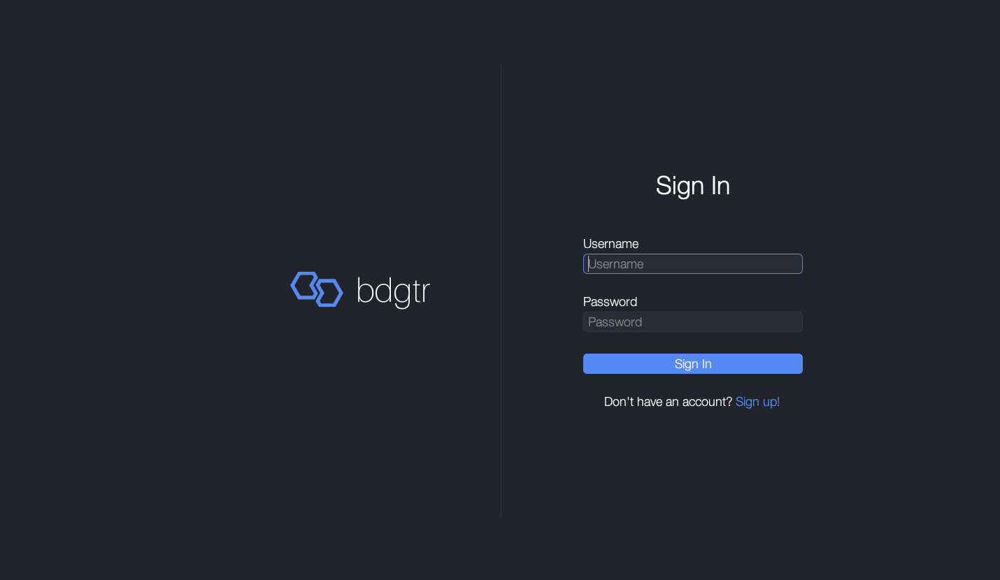
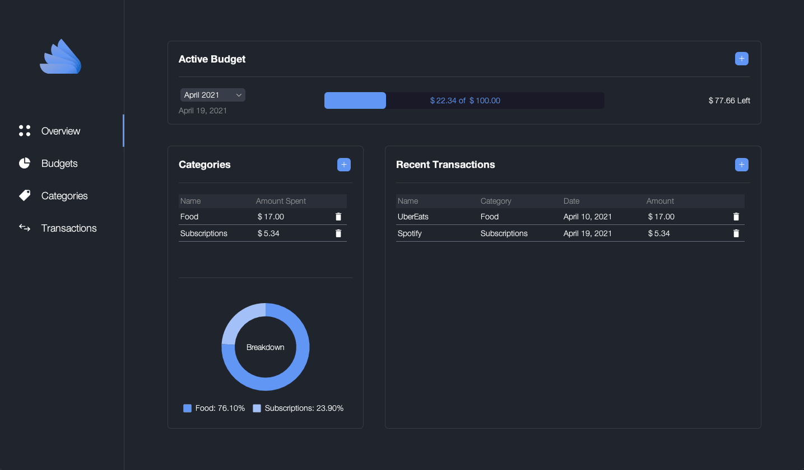

# bdgtr
A minimal personal finance application that helps you create budgets and track your spending.

## Features
Create **unlimited**:
* accounts
* budgets
* categories
* transactions

View:
* a breakdown of a budget by category
* transaction history

## Screenshots

## Dependencies
* [FlatLaf - Flat Look and Feel](https://github.com/JFormDesigner/FlatLaf)
* [JFreeChart](https://github.com/jfree/jfreechart)
* [JSON in Java](https://github.com/stleary/JSON-java)
* [LGoodDatePicker](https://github.com/LGoodDatePicker/LGoodDatePicker)